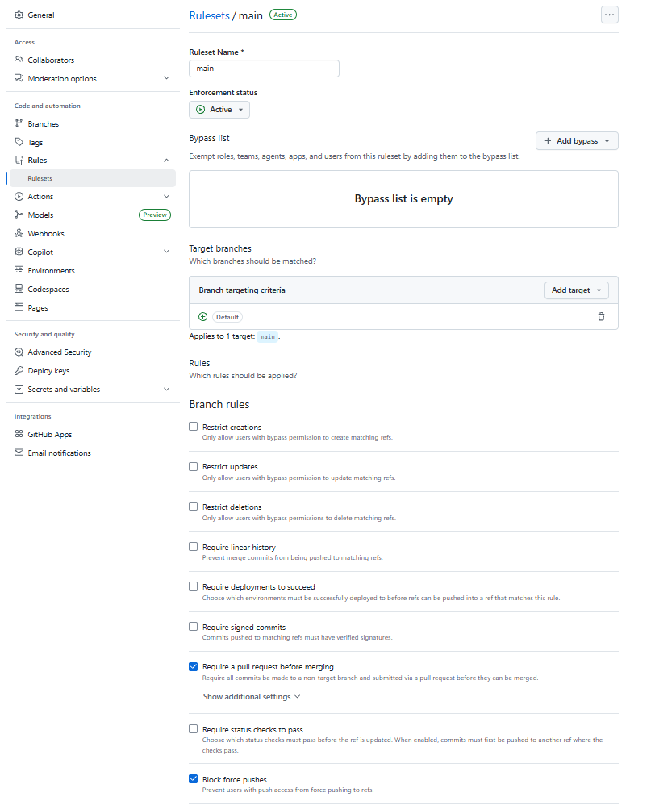
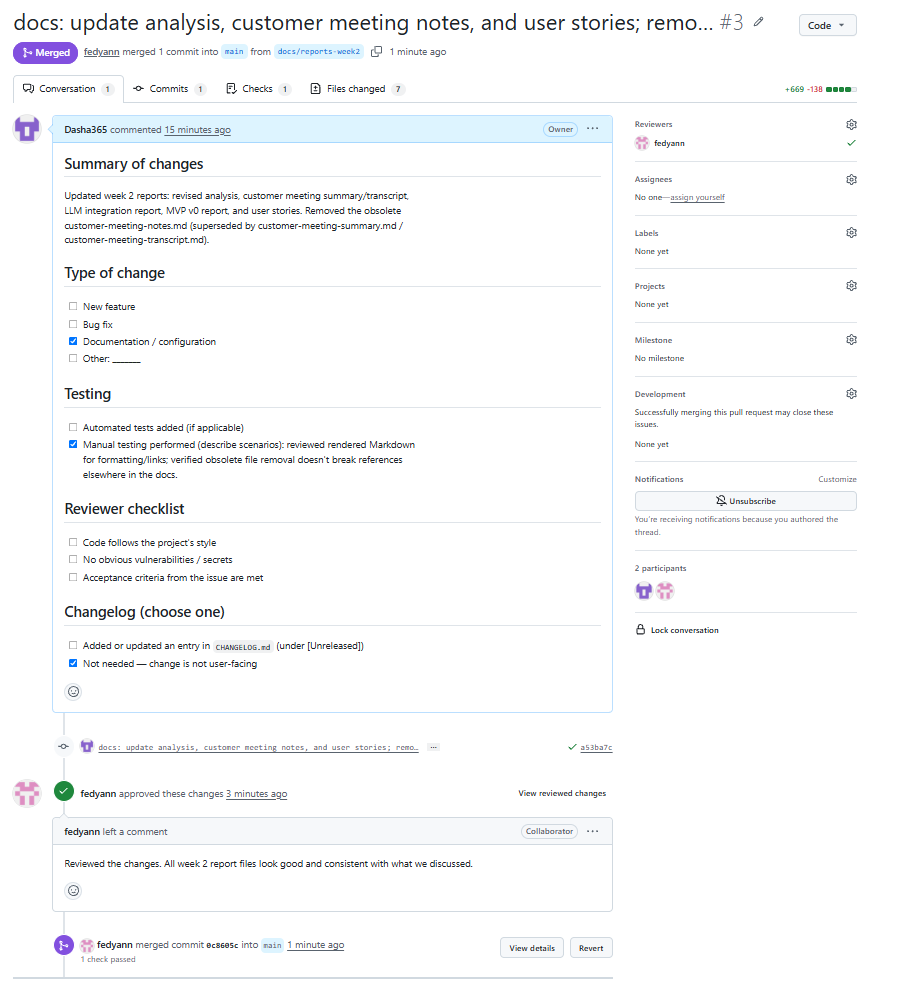
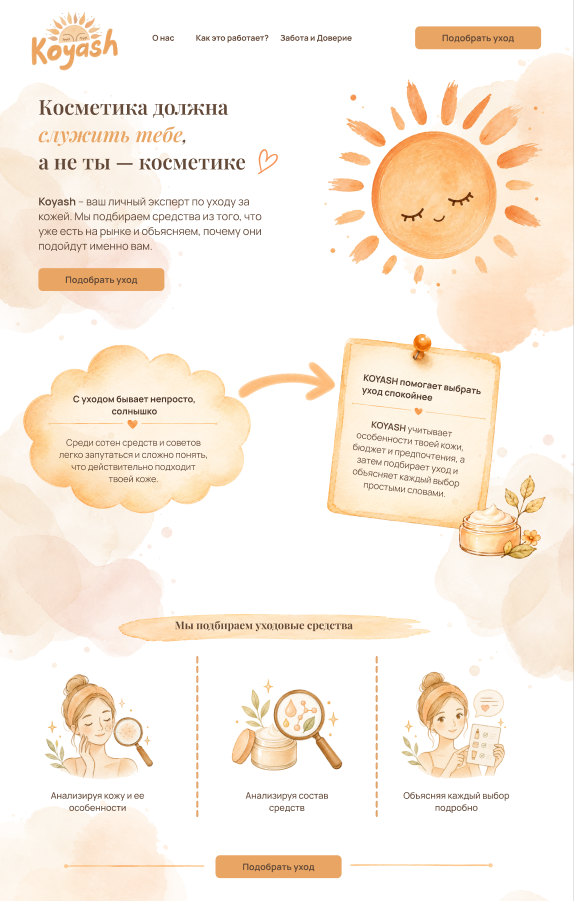
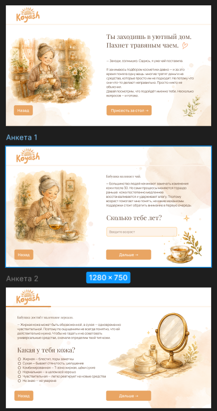
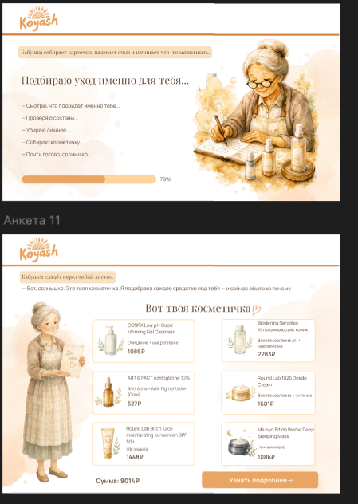
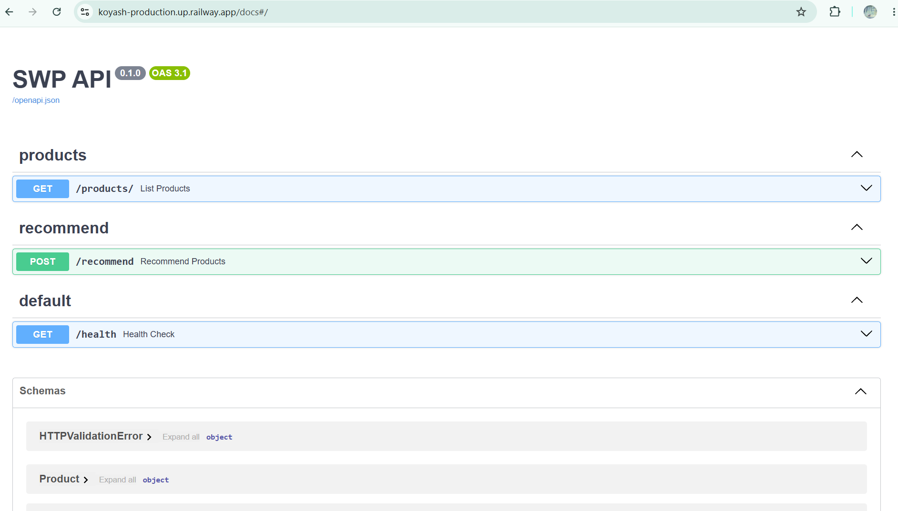

# KOYASH — Week 2 Report (Assignment 2)

**Project:** KOYASH — Team 11
**Description:** A web service that builds a personalized cosmetic bag from a real product catalog using a step-by-step questionnaire and rule-based filtering, and explains every recommendation.
**License:** [MIT License](../../LICENSE)

This report is an index for the Assignment 2 submission. Substantive content lives in the dedicated files linked below.

## User stories

- [user-stories.md](user-stories.md) — personas, all user stories with stable IDs, MoSCoW priorities, Requirement Status, and the initial proposed MVP v1 scope.

## Prototype and interface artifacts

KOYASH's externally used interface is graphical, so the interface prototype is an interactive Figma prototype. The backend↔frontend API is internal and is documented as part of the MVP v0 foundation (see the MVP v0 report).

- Interactive prototype (public, view-only): [Figma prototype](https://www.figma.com/design/oaSIM2azCmAmEcFY6MZWq9/KOYASH-team-11-prototype?node-id=0-1&t=TtDNm8oalI0rfTHt-1)

## MVP v0

- [mvp-v0-report.md](mvp-v0-report.md) — purpose, limitations, and the repeatable smoke-check scenario.
- Deployment (hosted, public): <https://koyash-production.up.railway.app/docs>
- Local run instructions: [root README](../../README.md)
- Public video demonstration (< 2 min): <https://youtu.be/ftTVnoXQvI8>

## PR/MR workflow

- Minimal PR template: [.github/pull_request_template.md](../../.github/pull_request_template.md)
- Reviewed PRs created during Week 2: <https://github.com/Dasha365/koyash/pull/3>

## Link checking (Lychee)

- Lychee configuration: [lychee.toml](../../lychee.toml)
- Latest successful run on the protected default branch (`main`): <https://github.com/Dasha365/koyash/actions/runs/27503593524>
- Excluded links (justified in [lychee.toml](../../lychee.toml); manually verified accessible on 2026-06-13):
  - `http://localhost:8000/...` (root README "Running locally" and the local smoke-check in [mvp-v0-report.md](mvp-v0-report.md)) — local development URLs, never reachable from a CI runner; excluded via `exclude_loopback = true`.
  - `https://youtu.be/ftTVnoXQvI8` (demo video, linked above and in [mvp-v0-report.md](mvp-v0-report.md)) — YouTube blocks automated HTTP clients at the TLS/bot-detection layer, so lychee can never get a real response; manually confirmed the video plays normally in a browser.

## Screenshots

## Coverage

- **Prototype.** Covers the externally used interface for the initial proposed MVP v1 scope: US-02 (storytelling questionnaire), US-03 (controlled budget input), US-07 (ethical preferences) and US-08 (allergen exclusion) as questionnaire steps, and US-04 / US-05 / US-06 (the ordered cosmetic bag with per-product justification).
- **MVP v0.** A backend product foundation, not a complete user story. As documented in [mvp-v0-report.md](mvp-v0-report.md) (which also contains the repeatable smoke-check scenario), it represents US-04 (`GET /products` serving the real catalog) and the rule-based filters behind US-03, US-07, and US-08 (`POST /recommend`).

## Customer review

- **Meeting summary:** [customer-meeting-summary.md](customer-meeting-summary.md)
- **Transcript:** [customer-meeting-transcript.md](customer-meeting-transcript.md) — sanitized English transcript, published with the customer's explicit approval.

## Analysis and LLM usage

- [analysis.md](analysis.md) — learning points, validated assumptions, needs clarification, planned response.
- [llm-report.md](llm-report.md) — how AI/LLM tools were used.