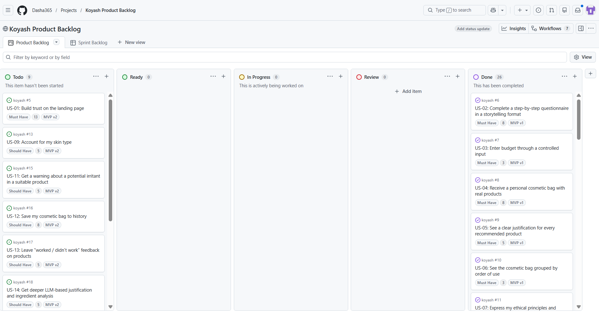
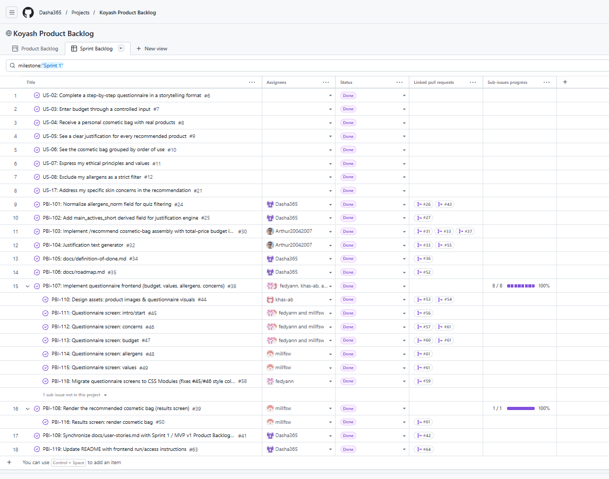
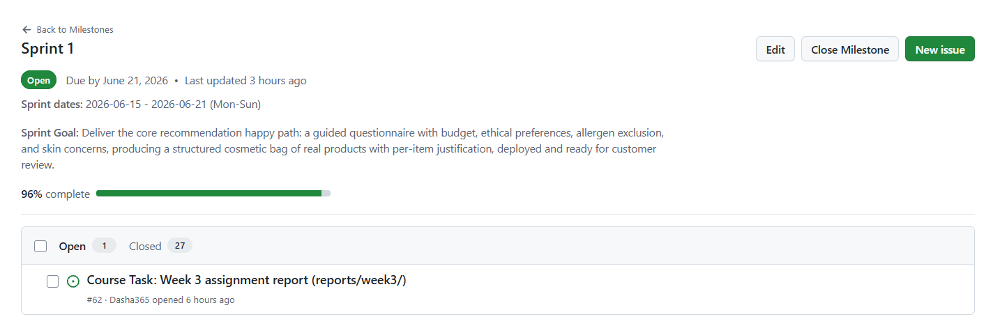
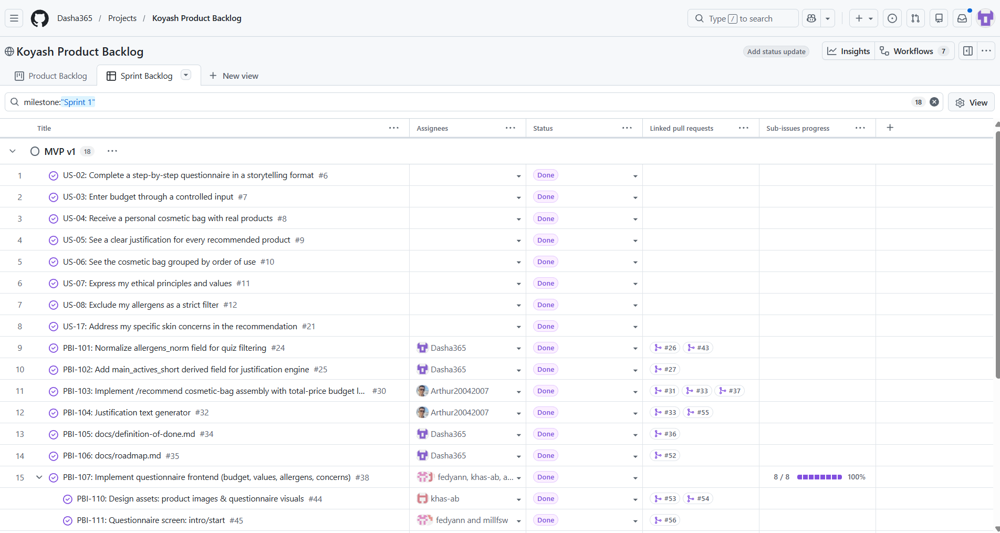
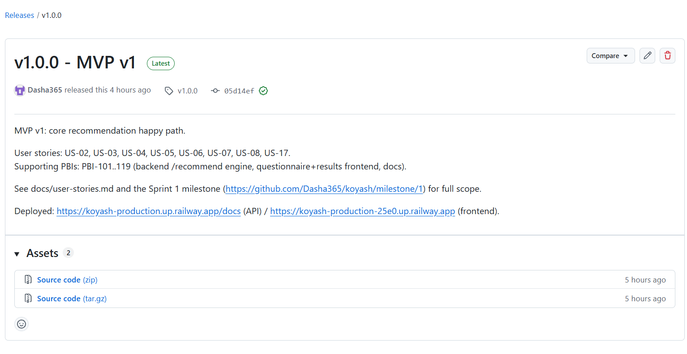
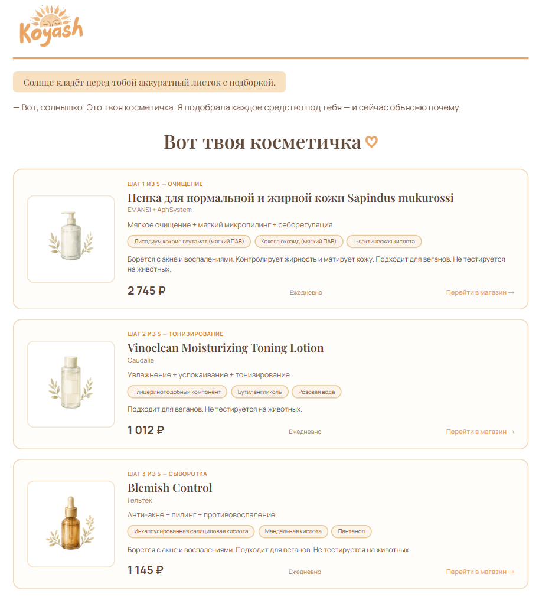
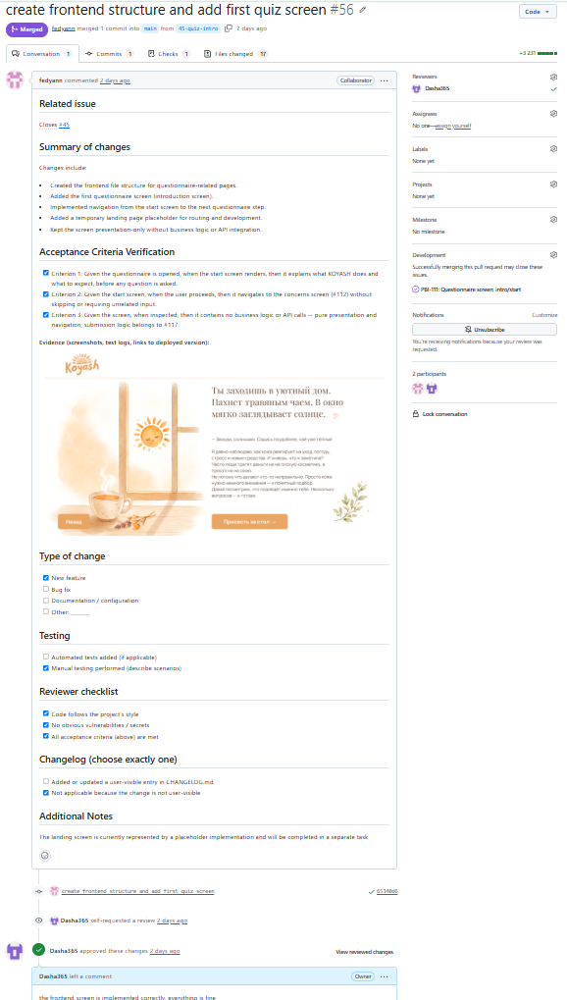

# Week 3 Report — KOYASH (Team 11)

## 1. Project

**KOYASH** is a skincare-product recommendation service: a user answers a guided
questionnaire (budget, allergens, ethical preferences, skin concerns) and receives
a personalized, ordered cosmetic-bag routine with per-product justification, drawn
from a real 69-product catalog. License: [MIT](../../LICENSE).

## 2. Scope since Assignment 2

17 user stories were migrated from [reports/week2/user-stories.md](../week2/user-stories.md)
into GitHub Issues and indexed in [docs/user-stories.md](../../docs/user-stories.md)
(issues [#5](https://github.com/Koyash-team/koyash/issues/5)–[#21](https://github.com/Koyash-team/koyash/issues/21)).
One new story, **US-17** (skin concerns), was added during refinement with the next
unused stable ID. The Product Backlog was further refined into 35 qualifying PBIs
(15 qualifying user stories, after excluding the 2 `Won't Have` stories US-15/US-16,
plus 19 supporting/technical PBIs and 1 bug fix, after excluding 1 Course Task issue)
— see the [Product Backlog board](https://github.com/users/Dasha365/projects/1/views/1).

## 3. Customer feedback from Assignment 2 addressed in MVP v1

Per [reports/week2/customer-meeting-summary.md](../week2/customer-meeting-summary.md) ("Resulting changes"):

- **US-01 (landing page) dropped from MVP v1** per the customer's request to trim scope — tracked as `MVP v2` on the board, not in Sprint 1.
- **US-02** reworded so the narrative flow serves the questionnaire experience, decoupled from recommendation quality — implemented in the live questionnaire flow.
- **US-04** reinforced to select only from the real 69-product catalog (no hallucinated products) — implemented in `/recommend`.
- **US-05** re-anchored on building trust/informed decisions rather than pushing a purchase — implemented via the `justification` block in every bag item.
- **US-07** persona changed to "ethically-driven user" — reflected in `docs/user-stories.md`.
- **US-09** moved to `Should Have` (skin-type data still not populated) — unchanged, still `Should Have` / `MVP v2`.
- **US-03** budget input: the customer leaned toward a free numeric input; the team shipped a 3-segment (`low`/`mid`/`high`) selection instead — documented rationale in `docs/user-stories.md` (US-03 notes).

## 4–5. User-story indexes

- Historical (Assignment 2): [reports/week2/user-stories.md](../week2/user-stories.md)
- Current (Assignment 3): [docs/user-stories.md](../../docs/user-stories.md)

## 6–7. Backlog and Sprint boards

- Product Backlog board/view: <https://github.com/users/Dasha365/projects/1/views/1>
- Sprint Backlog board/view: <https://github.com/users/Dasha365/projects/1/views/2>

## 8. Sprint milestone

[Sprint 1](https://github.com/Dasha365/koyash/milestone/1) — 2026-06-15 to 2026-06-21 (Mon–Sun).
Sprint Goal (from the milestone description): *"Deliver the core recommendation
happy path: a guided questionnaire with budget, ethical preferences, allergen
exclusion, and skin concerns, producing a structured cosmetic bag of real products
with per-item justification, deployed and ready for customer review."*

## 9–10. Story Points

- **Total Product Backlog: 144 SP** recorded across 31 estimated PBIs (15 user stories + 16 supporting PBIs), Modified Fibonacci scale.
- **Total current Sprint (Sprint 1): 98 SP** recorded (8 user stories = 36 SP, 16 supporting PBIs = 62 SP).
- [#38](https://github.com/Koyash-team/koyash/issues/38) (PBI-107) and [#39](https://github.com/Koyash-team/koyash/issues/39) (PBI-108) are intentionally unestimated tracking-parent epics — they were decomposed into PBI-110…116, whose points sum to their scope, avoiding double counting.
- [#51](https://github.com/Koyash-team/koyash/issues/51) (PBI-117) and [#40](https://github.com/Koyash-team/koyash/issues/40) (bug) were closed and their scope folded into #46–#50 and #46 respectively (2026-06-20) — not separately estimated or boarded by design.

## 11. MVP version view

`MVP version` is a custom single-select Project field (`MVP v1` / `MVP v2` / `MVP v3` / `Post-MVP`), grouped in the Sprint Backlog view: <https://github.com/users/Dasha365/projects/1/views/2>.

## 12. Selected MVP v1 scope

8 Must-Have user stories — US-02, US-03, US-04, US-05, US-06, US-07, US-08, US-17 — plus
18 supporting PBIs (PBI-101…119) covering the backend recommendation engine, the
questionnaire/results frontend, and supporting docs (DoD, roadmap, user-story sync).
This is the "core recommendation happy path" defined in the Sprint 1 Goal above and
in [docs/roadmap.md](../../docs/roadmap.md).

## 13. PBI types, statuses, priorities, Sprint/MVP tracking, decomposition

Canonical definitions live in [Process_Requirements.md](../../docs/Process_Requirements.md)
(Work Status, MoSCoW, Sprint milestone usage) — not restated here. Project-specific
implementation: `Status` (Todo/Ready/In Progress/Review/Done), `MoSCoW`, `Story Points`,
and `MVP version` are tracked as custom fields on the ["Koyash Product Backlog"](https://github.com/users/Dasha365/projects/1)
GitHub Project; `Milestone` uses the native GitHub milestone (Sprint 1). PBI types are
`User Story`, `Other PBI` (Technical Task / Infrastructure / Design / Testing /
Deployment / Documentation / Research), `Bug Report`, `Course Task`. Two large user
stories (PBI-107, PBI-108 — questionnaire and results screens) were decomposed into
7 smaller linked screen-level PBIs (PBI-110…116) so three frontend contributors could
work in parallel without blocking each other.

## 14. Roadmap direction

See [docs/roadmap.md](../../docs/roadmap.md) for the full Sprint-by-Sprint plan. Sprint 2
focus: harden the rule-based flow, add skin-type personalization once `skintype` data
is populated, and deliver the landing page (US-01, deferred from MVP v1). Sprint 3
(direction): introduce LLM-based justification on top of the existing rule-based engine.

## 15. Verification evidence for MVP v1 PBIs

| PBI | Issue | Verifying PR(s) |
|---|---|---|
| PBI-101 allergens_norm | #24 | [#26](https://github.com/Dasha365/koyash/pull/26), [#43](https://github.com/Dasha365/koyash/pull/43) |
| PBI-102 main_actives_short | #25 | [#27](https://github.com/Dasha365/koyash/pull/27) |
| PBI-103 /recommend assembly | #30 | [#31](https://github.com/Dasha365/koyash/pull/31), [#33](https://github.com/Dasha365/koyash/pull/33), [#37](https://github.com/Dasha365/koyash/pull/37) |
| PBI-104 justification generator | #32 | [#33](https://github.com/Dasha365/koyash/pull/33), [#55](https://github.com/Dasha365/koyash/pull/55) |
| PBI-105 definition-of-done.md | #34 | [#36](https://github.com/Dasha365/koyash/pull/36) |
| PBI-106 roadmap.md | #35 | [#52](https://github.com/Dasha365/koyash/pull/52) |
| PBI-109 sync user-stories.md | #41 | [#42](https://github.com/Dasha365/koyash/pull/42) |
| PBI-110 design assets | #44 | [#53](https://github.com/Dasha365/koyash/pull/53), [#54](https://github.com/Dasha365/koyash/pull/54) |
| PBI-111 intro screen | #45 | [#56](https://github.com/Dasha365/koyash/pull/56) |
| PBI-112…116 questionnaire/results screens | #46–#50 | [#61](https://github.com/Dasha365/koyash/pull/61) |
| PBI-117 integration | [#51](https://github.com/Koyash-team/koyash/issues/51) — closed 2026-06-20, folded into #46–#50 (see #38/#39/#46 for the explanation); no separate PR | — |
| PBI-118 CSS Modules | #58 | [#59](https://github.com/Dasha365/koyash/pull/59) |
| PBI-119 README instructions | #63 | [#64](https://github.com/Dasha365/koyash/pull/64) |

## 16. Current product status

A live, end-to-end happy path: a user can complete the questionnaire on the deployed
frontend and receive an ordered, justified cosmetic bag from the deployed backend
(verified via direct API smoke test and inspection of the deployed JS bundle, 2026-06-21).
Known accepted gap: "occasional" treatments (exfoliant/mask) are not exposed as a
separate block in the API response or UI, distinguishable only via a per-item `tier`
field — deferred, not blocking this submission.

## 17. Next steps

Send the customer 3–5 sample `/recommend` request/response JSON pairs (action
point from the Sprint Review); apply the requested design/copy changes; plan
Sprint 2 (skin-type personalization, landing page, design polish, LLM-based
justification direction for Sprint 3).

## 18. Contribution traceability

| Member | Issues (assignee) | PRs (author) | Review activity |
|---|---|---|---|
| Daria (`Dasha365`) | #24,25,34,35,41,63 | #1,2,3,4,22,23,26,27,36,37,42,43,52,55,64 | Approved: #31,33,53,56,57,59,60,61 |
| Arthur (`Arthur20042007`) | #30,32,51 | #28,29 (closed unmerged),31,33 | Approved: #22,23,26,27,37,42,43 |
| Anna (`fedyann`) | #45,46,47,58 | #56,57,59,60 | Approved: #3,36,52 |
| Milana (`millfsw`) | #38,39,45,46,47,48,49,50 | #61 | Approved: #2,4,54,64 |
| Khasana (`khas-ab`) | #44 | #53,54 | Approved: #55 |

All 38 issues were filed by Daria (team lead/PO role); the table above reflects
*assignee* (implementer), not issue authorship.

## 19–28. Workflow links

- SemVer release mapped to MVP v1: [v1.0.0](https://github.com/Dasha365/koyash/releases/tag/v1.0.0)
- [CHANGELOG.md](../../CHANGELOG.md)
- [Process_Requirements.md](../../docs/Process_Requirements.md)
- [docs/roadmap.md](../../docs/roadmap.md)
- [docs/definition-of-done.md](../../docs/definition-of-done.md)
- Issue templates: [.github/ISSUE_TEMPLATE/](../../.github/ISSUE_TEMPLATE/) · Extended PR template: [.github/pull_request_template.md](../../.github/pull_request_template.md)
- Reviewed issue-linked PRs created during Week 3 (Sprint 1): [#22](https://github.com/Dasha365/koyash/pull/22)–[#64](https://github.com/Dasha365/koyash/pull/64) (23 merged PRs; e.g. [#37](https://github.com/Dasha365/koyash/pull/37) and [#61](https://github.com/Dasha365/koyash/pull/61) for detailed AC verification — see section 15 above for the full per-PBI mapping)
- Delivered MVP v1: frontend <https://koyash-production-25e0.up.railway.app> · backend/Swagger <https://koyash-production.up.railway.app/docs>
- Run/access instructions: [root README.md](../../README.md#running-locally)
- Demo video (<2 min): <https://youtu.be/SDuBlborKr0>

## 29. Screenshots

**Product Backlog view:**

**Sprint Backlog view:**

**Sprint 1 milestone:**

**MVP version field, grouped view:**

**SemVer release (v1.0.0, mapped to MVP v1):**

**Delivered MVP v1 (live frontend):**

**Example reviewed issue-linked PR:**

## 30–31. Customer review

The Sprint Review meeting with the customer took place on 2026-06-20. The customer
approved the MVP v1 scope and increment; see:

- [customer-review-summary.md](customer-review-summary.md)
- [customer-review-transcript.md](customer-review-transcript.md)

## 32–34. Reflection, retrospective, LLM report

[reflection.md](reflection.md) · [retrospective.md](retrospective.md) · [llm-report.md](llm-report.md)
